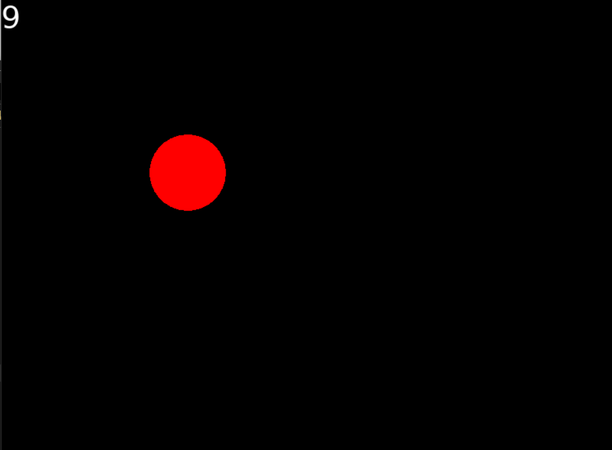

# Circle Clicker

A simple game I built alongside [Kyle Schaub's Love2D Introduction Course](https://www.youtube.com/watch?v=wttKHL90Ank).

## How to play
At the start of the game a red circle will appear. You have to click inside of the circle in order to increase your score (visible in the upper left corner). The circle will change it's position afterwards. There is no set goal, you can increase your score infinitely.

Have fun!